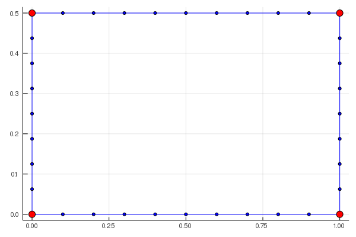

# StructuredMeshing.jl


Structured Meshing algrorithms implemented in Julia, targeted at Abaqus FEM solver.

In Abaqus the mesh creation is done top-down. Starting from an overall geometry partitions are created and
meshed. While this approach works well within the graphical user interface, I consider it very elaborate during
scripted creation of simple meshes. Therefore this package follows a bottom up approach.

**WARNING: This package is in very early development stage**

## Installation

Enter the package manager and install from Git:

```
pkg > add https://github.com/helo9/StructuredMeshing.jl
```

## Usage

Mesh creation consists of two steps within this package: defintion and generation. The mesh definition
starts with vertices. From two vertices a boundary can be created using `connect`.

```julia
meshdef = emptyMeshDef()

# create first vertex
v1 = addVertex!(meshdef, [0.0, 0.0])

# create second vertex
v2 = addVertex!(meshdef, [1.0, 0.0])

# create boundary with 10 mesh nodes
bl = connect!(meshdef, v1, v2, 10)
```

As an alternativ one could extrude the first vertex to simultaneous create second vertex
and create boundary.

```julia
# meshdef, v1 are defined

bound1 = extrude!(meshdef, v1, [1.0, 0.0], 1.0, 10)
```

`extrude` and `connect` return `BoundaryLinks`s. Those can be extruded again resulting in twodimensional blocks:

```julia
block1 = extrude!(meshdef, bound1, [0.0, 1.0], 1.0, 10)

show(block1)
```



The returned `BlockLink` named `block1` can again be used to extrude its boundaries and build more complex
meshes. We stop here and create an mesh:

```julia
mesh1 = mesh(meshdef)

show(mesh1)
```


